# Developer Guide: TradeLog

## 1. Acknowledgements

* **Java Standard Library**: Used for core logic, collections, and I/O operations.
* **Checkstyle**: Enforcement of coding standards (Google Style).
* **Gradle**: Build automation and dependency management.
* **SE-EDU AddressBook-Level 3**: Structural inspiration for CLI parsing and architectural patterns. [Source](https://se-education.org/addressbook-level3/)

---

## 2. Design & Implementation

### 2.1 Architecture Overview

TradeLog follows a modular CLI architecture, separating concerns into four main components:

* **Logic**: Handles prefix-based command parsing (e.g., `t/`, `d/`) and execution flow for commands.
* **Model**: Encapsulates the `Trade` entity and the `TradeList` collection, handling in-memory trade data and `R`-multiple calculations.
* **Storage**: Handles persistence of profile data in the `data/` directory. New profiles save in plaintext by default, and the `encrypt` command can toggle the save mode.
* **UI**: Manages formatted console output and user interaction.

The diagram below shows the high-level flow of a user command through the system:

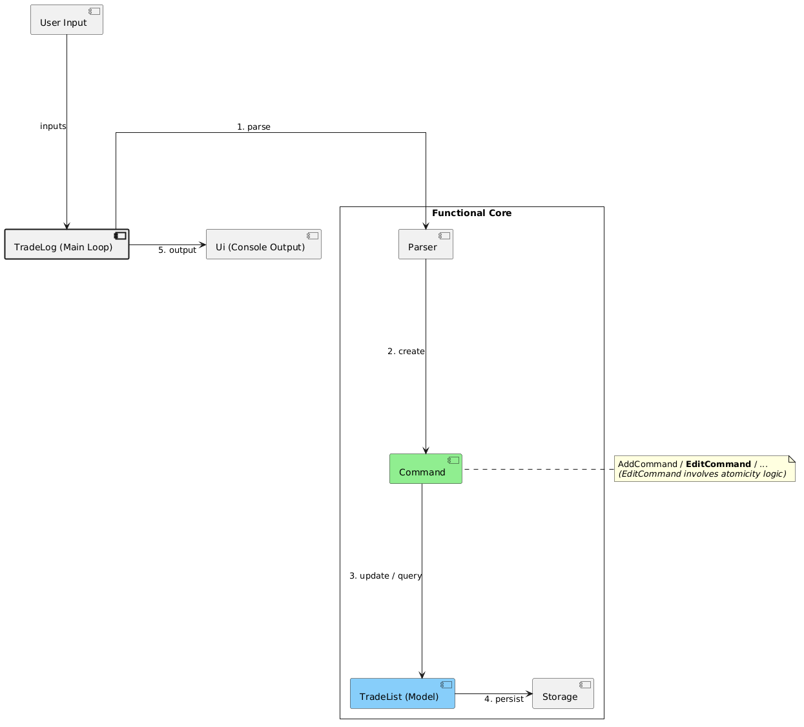

---

### 2.2 UI Component

---

##### Architecture-Level Description

The `Ui` class is TradeLog's primary console interaction component. It handles both output and selected input operations for the CLI, including welcome messages, trade displays, status feedback, error messages, and reading commands or credential prompts from the user.

`Ui` depends on `TradeList`, `Trade`, `StrategyStats`, and `ParserUtil` to format and present data, but it has no dependency on `Storage`, `Parser`, or any concrete `Command` class. This keeps the component broadly reusable across command flows and makes it straightforward to test in isolation by capturing console output.

`Ui` serves as the console boundary for user-facing input and output, allowing command classes such as `ListCommand`, `FilterCommand`, and `SummaryCommand` to delegate presentation work rather than formatting console output themselves.

##### Component-Level Description

`Ui` exposes the following categories of methods:

| Method Category        | Examples                                                                | Purpose                                            |
|------------------------|-------------------------------------------------------------------------|----------------------------------------------------|
| Input methods          | `readCommand()`, `readPassword(String)`, `readLine(String)`             | Read console input through a shared scanner        |
| Lifecycle messages     | `showWelcome()`, `showGoodbye()`, `closeScanner()`                      | Start and end the CLI session cleanly              |
| Trade display          | `printTradeList(TradeList)`, `printTrade(Trade)`                        | Format and print trade data                        |
| Feedback messages      | `showTradeAdded()`, `showTradeDeleted()`, `showTradeUpdated(int)`       | Confirm successful state-changing operations       |
| Summary display        | `showSummary(...)`, `showSummaryEmpty()`, `showStrategyComparison(...)` | Render aggregate and per-strategy performance data |
| Undo and status output | `showUndoSuccess()`, `showUndoUnavailable()`, `showMessage(String)`     | Display general status updates                     |
| Error display          | `showError(String)`                                                     | Wrap error output in a divider block               |

The class keeps a shared `Scanner` as an instance field so the same input stream can be reused throughout the session. Output blocks are structured using a fixed 80-character divider line (`DIVIDER`) produced by `"-".repeat(80)`, which keeps the CLI visually consistent.

Logging is embedded at the `INFO` level for normal interactions and `WARNING` level for errors using `java.util.logging.Logger`. This allows UI activity to be traced without changing the user-visible console format.

`readCommand()` returns `null` when the input stream is no longer available, allowing the main loop to terminate cleanly instead of repeatedly treating end-of-input as an empty command.

##### Sequence Diagram - `Ui.printTradeList(...)`

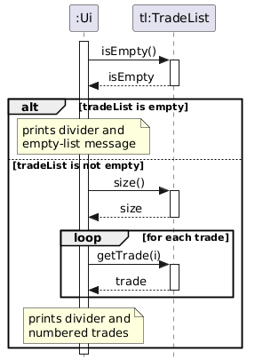

##### Design Rationale

The alternative considered was to have each `Command` class print directly to `System.out`. This was rejected because:

1. It would scatter output logic across many classes, making visual consistency hard to enforce.
2. Unit testing would require capturing `System.out` in every command test rather than in one place.
3. Changing the output format (e.g., adding colour codes, or redirecting to a file) would require modifying every command.

Keeping most console interaction in `Ui` also lets tests such as `UiTest` and `ListCommandTest` verify behavior by capturing output around a small number of focused methods.


`Ui` is tested using a `captureOutput` helper that temporarily redirects `System.out` to a `ByteArrayOutputStream`. This keeps the tests lightweight and avoids any dependency on mocking frameworks. The `UiTest` cases cover empty list rendering, welcome message formatting, and error message wrapping.

---
### 2.3 Parser Component

##### Architecture-Level Description

The parsing architecture is responsible for translating raw user input from the CLI into executable `Command` objects. To maintain separation of concerns and ensure financial data integrity, this logic is decoupled into three distinct utility classes: `Parser` (the command router), `ArgumentTokeniser` (the string extractor), and `ParserUtil` (the domain validator).

It takes the raw string, identifies the user's intent, extracts the variable data, enforces strict mathematical trading rules, and ultimately outputs a safe, validated command ready for execution.

##### Component-Level Description

```
«utility»
Parser
  |
  |-- parseCommand(userInput)
        |
        |-- routes to specific Command constructor
        \-- throws TradeLogException on unknown command

«utility»
ArgumentTokeniser
  |
  \-- tokenise(userInput, prefixes)
        |
        \-- returns HashMap<String, String> of prefix-value pairs

«utility»
ParserUtil
  |
  |-- parsePrice(priceString, fieldName)
  |-- parseTicker(ticker)
  |-- parseDirection(direction)
  |-- parseStrategy(strategy)
  |-- validatePrices(entryPrice, stopLossPrice)
  \-- validateStopLoss(direction, entryPrice, stopLossPrice)
```

The general parsing sequence for a complex command follows these steps:

1. `Parser` intercepts the raw string, splitting it into a `commandWord` and an `arguments` string.

2. A `switch` expression routes the `arguments` string to the corresponding `Command` constructor (e.g., `AddCommand`).

3. The command constructor delegates the `arguments` string to `ArgumentTokeniser`, which extracts a map of prefix-value pairs (e.g., `t/` -> `AAPL`).

4. The command extracts the mapped values and passes them to `ParserUtil` to enforce type safety (e.g., converting a string to a `double`) and trading logic (e.g., verifying stop-loss validity).

5. Once fully validated, the fully instantiated `Command` object is returned to the logic manager.

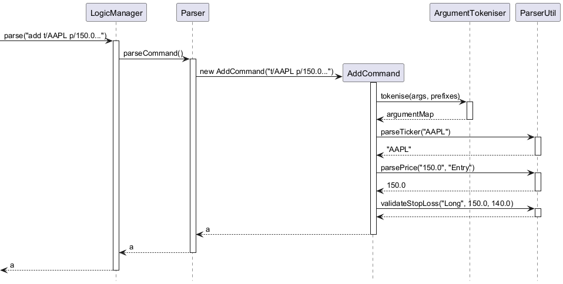

##### Design Rationale

**Centralisation of Validation:** An alternative considered was placing validation logic directly inside the respective `Command` classes (e.g., hardcoding the stop-loss verification inside `AddCommand`). This was rejected because it would lead to heavy code duplication across other commands that mutate trade states, such as `EditCommand`. Centralising this in `ParserUtil` keeps the commands as thin orchestrators and ensures mathematical trading rules are uniformly applied.

**Tokenisation Data Structure:** `ArgumentTokeniser` returns a `HashMap<String, String>` rather than a `List` of pairs. This was chosen to provide O(1) lookup time when commands need to retrieve their required parameters by prefix key, improving code readability and performance during high-speed data entry.

---

### 2.4 Model Component

##### Architecture-Level Description

The model layer represents the application's in-memory trade data. Its main responsibilities are to store individual trades, expose collection-level operations over the current trade set, and provide the trade attributes needed by read-only analytics such as `summary`, `filter`, and `compare`.

The central model classes are `Trade` and `TradeList`. `Trade` represents a single logged trade, while `TradeList` acts as the application's mutable collection of trades. Commands interact with the model through these classes rather than managing raw strings or low-level collections directly.

##### Component-Level Description

`Trade` stores the fields captured from user input, including ticker, date, direction, entry price, exit price, stop-loss price, and strategy. It also exposes derived values such as the trade's `R`-multiple and derived outcome, which are used by analytics features.

`TradeList` wraps the current list of `Trade` objects and provides collection operations such as adding, deleting, retrieving, and iterating over trades. This keeps list-management behavior centralized and allows command classes to operate on a consistent abstraction.

##### Design Rationale

Separating `Trade` from `TradeList` keeps entity-level behavior and collection-level behavior distinct. This is simpler to reason about than storing everything in one large manager class and makes command logic easier to test because commands can work against a focused model API.

---

### 2.5 Storage Component

##### Architecture-Level Description

The storage layer is responsible for persistence of trade data across application runs. In the current version, it supports password-protected local profile files stored under the `data/` directory, with encryption disabled by default for new profiles and profile resolution handled at startup before the main command loop begins.

This layer is centered around `Storage`, which reads and writes trade data with optional AES encryption, and `ProfileManager`, which determines which profile file to use based on the password entered by the user.

##### Component-Level Description

`Storage` handles serialization, encryption, decryption, and file access. New `Storage` instances start with encryption disabled, but the `encrypt` command can turn it on or off before saving. It operates on `TradeList` data and does not depend on parsing or command classes.

`ProfileManager` coordinates startup profile selection. It prompts for a password through `Ui`, rejects blank passwords, attempts to match that password to an existing profile, and creates a new profile when required.

##### Design Rationale

Keeping persistence outside the command classes prevents file-handling and encryption logic from leaking into individual features such as `add`, `edit`, or `delete`. This separation also makes it easier to evolve the storage format independently from the CLI command flow.

---

### 2.6 ListCommand

##### Architecture-Level Description

`ListCommand` is a simple read-only command that displays all currently logged trades. It takes no arguments, performs no mutation of application state, and delegates the presentation work to `Ui`. Its role is to bridge the user's `list` request to the existing trade-list rendering logic.

It extends `Command`, the abstract base class that defines the `execute(TradeList, Ui, Storage)` contract. Because `ListCommand` does not exit the application, it inherits the default `isExit()` return value of `false`.

##### Component-Level Description

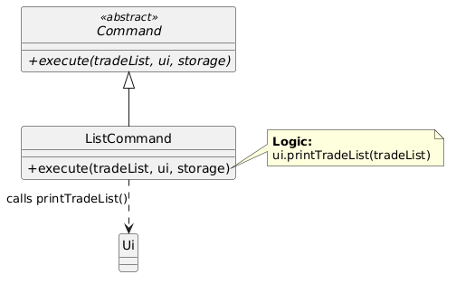

The `execute` method:

1. Asserts that `tradeList` and `ui` are non-null (defensive programming).
2. Logs the current trade count at `INFO` level.
3. Calls `ui.printTradeList(tradeList)`, which handles both the empty-list case and the populated-list case.
4. Logs successful completion.

The `storage` parameter is accepted by the method signature (to satisfy the `Command` contract) but is deliberately unused, as listing trades requires no persistence interaction.

##### Sequence Diagram - Full `list` command flow

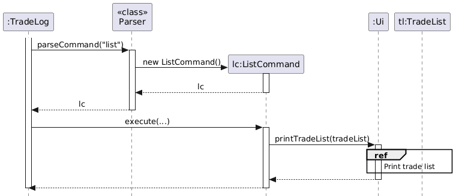

##### Design Rationale

An alternative considered was to have `ListCommand` access `TradeList` directly and format the output itself. This was rejected for the same centralisation reason described in the `Ui` section: it would duplicate formatting logic and make the output inconsistent with other commands. The current design keeps `ListCommand` as a thin orchestrator - it knows *when* to display trades, but not *how*.


`ListCommand` is tested using the same `captureOutput` pattern as `Ui`. The `ListCommandTest` cases verify that the command delegates correctly to `Ui` for display and that `isExit()` remains `false`, confirming that the command is read-only and does not terminate the application.

---
### 2.7 AddCommand

##### Architecture-Level Description

The `AddCommand` is a core state-changing operation responsible for introducing new trades into the TradeLog system. It acts as the primary bridge between the `Parser` component (which supplies the raw user input), the `Model` component (by instantiating new `Trade` objects and updating the in-memory `TradeList`), and the `Ui` component (by showing the resulting trade summary and confirmation message).

To adhere to the principle of Separation of Concerns, the execution of the `add` feature is explicitly split into two distinct phases: an initialization/validation phase, and an execution/mutation phase.

##### Component-Level Description

1. Construction & Validation Phase: When the user inputs an `add` command, the `Parser` creates a new `AddCommand(String arguments)`. The constructor immediately passes the raw string to the `ArgumentTokeniser` to map prefixes to their respective string values. It then utilizes `ParserUtil` to strictly validate the financial logic of the inputs (e.g., ensuring a `long` position does not have a stop-loss higher than the entry price, and checking that all prices are valid positive numbers). If any validation fails during this step, a `TradeLogException` is thrown before the `TradeList` or `Storage` is ever accessed.

2. Execution Phase: Once the `AddCommand` is successfully instantiated with a fully valid `Trade` object held in its internal state, the main loop calls `execute(tradeList, ui, storage)`. The command appends the new trade to the `TradeList` and triggers the `Ui` to display a confirmation message with the formatted trade details. Persistence is handled separately by the application's shutdown flow.

##### Sequence Diagram — Full `add` execution path

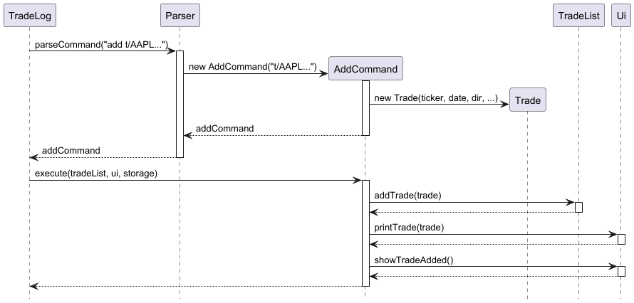

##### Design Rationale

The alternative considered having the constructor simply store the raw user string, pushing all tokenizing and validation inside `execute()`. This was rejected because it violates the Single Responsibility Principle. It would bloat the `execute()` method with string manipulation, financial logic validation, memory updates, and UI updates all at once, making unit testing significantly more difficult.

---

### 2.8 DeleteCommand

##### Architecture-Level Description

The `DeleteCommand` is a core state-changing operation responsible for removing existing trades from the TradeLog system. It acts as the bridge between the `Parser` component (which supplies the raw user input), the `Model` component (by locating and deleting the specified `Trade` object from the in-memory `TradeList`), and the `Ui` component (by displaying either a successful deletion message or an error message if the index is invalid at runtime).

To adhere to the principle of Separation of Concerns, the execution of the `delete` feature is explicitly split into two distinct phases: an initialization/validation phase, and an execution/mutation phase.

##### Component-Level Description

1. Construction & Validation Phase: When the user inputs a `delete` command, the `Parser` creates a new `DeleteCommand(String arguments)`. The constructor immediately trims the raw argument string and validates that it is neither missing nor blank. It then attempts to parse the argument into an integer index. If the input is not a valid integer, or if the parsed value is less than or equal to zero, a `TradeLogException` is thrown before the `TradeList` or `Ui` is ever accessed. 
2. Execution Phase: Once the `DeleteCommand` is successfully instantiated with a valid positive index stored in its internal state, the main loop calls `execute(tradeList, ui, storage)`. The command converts the user-facing 1-based index into the system’s internal 0-based index and attempts to remove the corresponding `Trade` from the `TradeList`. If the deletion succeeds, the deleted trade is printed and a confirmation message is shown through the `Ui`. If the index is out of bounds, the command catches the resulting `IndexOutOfBoundsException` and displays an error message instead. As with other state-changing commands, persistence is handled by the main loop architecture after successful execution.

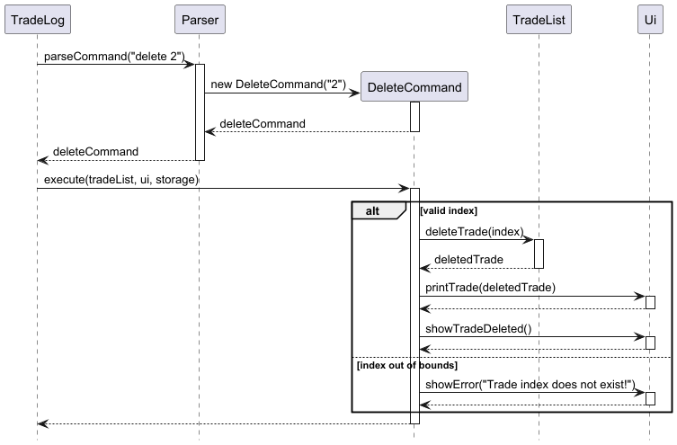

##### Design Rationale

An alternative considered letting `DeleteCommand` throw the `IndexOutOfBoundsException` back up to the main `TradeLog` execution loop. This was rejected because the main loop would then need specific catch blocks for every possible internal data structure error across all commands. Keeping the error handling localized to the command ensures the main loop remains clean and strictly focused on high-level orchestration.

---

### 2.9 SummaryCommand

##### Architecture-Level Description

`SummaryCommand` calculates and displays an aggregate mathematical performance report across the entire `TradeList`. Like `ListCommand`, it is a non-mutating operation; it reads the application's state to perform calculations but does not alter the data or interact with `Storage`.

##### Component-Level Description

When `execute()` is called, `SummaryCommand` first guards against an empty `TradeList`, triggering an early exit via `Ui.showSummaryEmpty()` if no trades exist.

If populated, it iterates through every trade in the list exactly once. During this single `O(n)` pass, it maintains running totals for total trades, winning trades, losing trades, total positive R-multiples, and total negative R-multiples. Break-even trades (where Risk/Reward equals 0) are safely skipped in the specific win/loss tallies but are correctly factored into the total trade count and Expected Value (EV) denominator.

After the loop completes, it calculates the win rate, average win, average loss, and EV, passing these final primitive floating-point values directly to `Ui.showSummary()` for formatting.

##### Sequence Diagram — `summary` execution and calculation

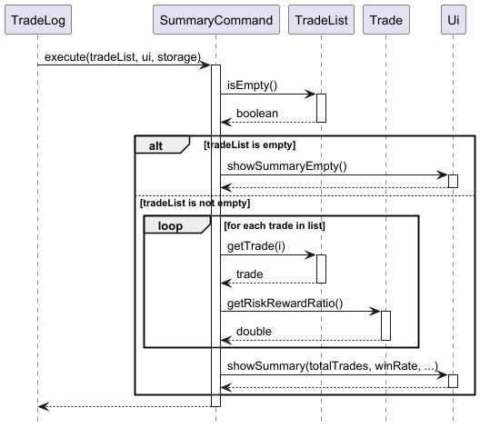

##### Design Rationale

The alternative considered was having the constructor simply store the raw user string and defer all parsing and validation to `execute()`. This was rejected because it would violate the Single Responsibility Principle. It would cause the `execute()` method to handle input sanitization, integer parsing, validity checks, model mutation, and UI interaction all in one place, making the command less modular and harder to test.

By validating the index during construction, the implementation ensures that only logically valid `DeleteCommand` objects can be created. This makes runtime execution simpler and more focused on state mutation and user feedback. In addition, handling out-of-bounds indices during execution is appropriate because whether an index exists depends on the current state of the `TradeList`, which is only known at runtime.

---

### 2.10 EditCommand

##### Architecture-Level Description
The `EditCommand` allows users to modify existing trades within the `TradeList`. To minimize user friction, it supports **Partial Updates**, where only specified prefixes (e.g., `t/`, `e/`) are modified while others remain unchanged. The implementation prioritizes **Atomicity**: the command validates the entire "new state" of the trade before any internal data is overwritten.

##### Component-Level Description
The `execute(tradeList, ui, storage)` method performs the following logic:

1.  **Retrieval**: Fetches the existing `Trade` object from the `TradeList` using `targetIndex`.
2.  **Defensive Assertions**: Employs **Java Assertions** to verify that `tradeList` and `ui` are not null, and that `tradeToEdit` was successfully retrieved.
3.  **Staging**: Pre-computes updated values using `parsedArgs`. If a prefix is present, `ParserUtil` is used to parse the new value; otherwise, the existing value from the `Trade` object is used.
4.  **Validation**: Calls `ParserUtil.validatePrices()` and `ParserUtil.validateStopLoss()` on the staged variables to ensure the proposed edit is financially logical.
5.  **Commitment**: Once validated, it calls the respective `set` methods on the `Trade` object and triggers the `Ui` to display the updated record.


##### Sequence Diagram — `edit` execution path

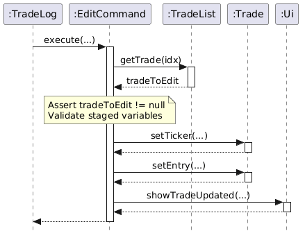

##### Design Rationale
* **Partial Updates**: Chosen over full replacement because trades contain 8+ fields; forcing a user to re-input all data to fix one typo (e.g., in a Ticker) is inefficient for a CLI tool.
* **Validation before Mutation**: Ensures that the `Model` never enters an invalid state (e.g., a Long position with a stop-loss above entry), maintaining data integrity.
* **Assertions**: Used for internal invariants. If `tradeToEdit` is null despite passing the index check, it indicates a critical failure in the `Model`'s list management that requires immediate developer attention.

### 2.11 Testing Strategy for `EditCommand` and Assertions

The `EditCommandTest` class ensures that the "Read-Validate-Commit" cycle works as intended.

**Key Test Cases:**
* **Statelessness of Unedited Fields**: Verifies that fields not specified in the `edit` command remain identical to their original values.
* **Boundary Validation**: Confirms that `TradeLogException` is thrown if an edit results in an invalid price relationship (e.g., Entry == Stop Loss).
* **Assertion Verification**: Although `assert` is typically for development, test environments are configured with `-ea` (enable assertions) to ensure that the internal null-checks added to `EditCommand` and `ListCommand` trigger correctly if invalid dependencies are provided.
---

### 2.12 FilterCommand

##### Architecture-Level Description

`FilterCommand` provides read-only querying of the in-memory `TradeList` without modifying any state. In the current implementation, it supports ticker filtering and strategy filtering only.

The constructor stores the raw criteria string and performs lightweight strategy validation only when the argument starts with `s/`.

The `execute` method:

1. Iterates through all trades in `tradeList`.
2. If the criteria starts with `s/`, expands a known shortcut such as `BB` to its canonical name before matching.
3. Strategy filters use `equalsIgnoreCase` against the stored strategy.
4. Non-strategy filters are treated as ticker searches and use case-insensitive substring matching.
5. Matching trades are printed with their original indices via `Ui.printIndexedTrades(...)`.
6. If no matches are found, `ui.showMessage("No trades found matching: ...")` is called.

##### Sequence Diagram — `filter t/AAPL` with two trades in list
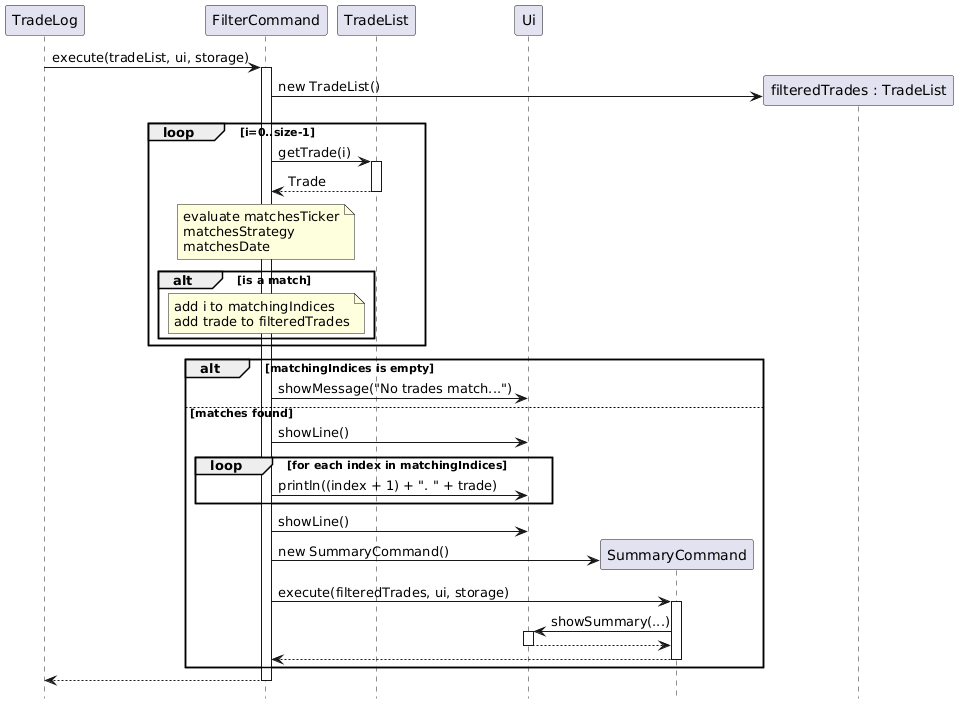

##### Supported Filter Criteria

| Prefix / form | Field matched | Matching behavior |
|---------------|---------------|-------------------|
| `t/AAPL`      | Ticker symbol | Case-insensitive substring match |
| `s/Breakout`  | Strategy name | Exact case-insensitive match after shortcut expansion |

##### Usage Examples

```
filter t/AAPL     → trades whose ticker contains "AAPL"
filter s/Breakout → trades stored with strategy Breakout
filter s/BB       → trades matching the canonical Breakout strategy
```

##### Design Rationale

**Why use original 1-based indices (from the full list) when displaying filtered results?**
Displaying the original index allows the user to immediately act on a filtered result — for example, using `edit 3` or `delete 3` on a trade found via `filter` without needing to re-run `list` to look up the index.

**Alternatives considered:**
- **A richer multi-prefix filter syntax**: Considered, but the current implementation keeps the command simple and focused on the supported use cases.

---

### 2.13 Strategy Shortcut Expansion Feature

##### Overview

Power users who log tens of trades per session type strategy names frequently. To reduce friction, v2.0 introduces **strategy shortcut expansion**: a set of predefined abbreviations that are automatically expanded to their full strategy names before a trade is saved.

The supported shortcuts are:

| Shortcut | Expanded Strategy Name |
|----------|------------------------|
| `BB`     | Breakout               |
| `TBF`    | Trend Bar Failure      |
| `PB`     | Pullback               |
| `MTR`    | Major Trend Reversal   |
| `HOD`    | High of Day            |
| `LOD`    | Low of Day             |
| `MR`     | Mean Reversion         |
| `TR`     | Trading Range          |
| `DB`     | Double Bottom          |
| `DT`     | Double Top             |

##### Architecture-Level Description

The strategy shortcut feature is implemented as part of the parser-side normalization flow. Strategy names are standardized before a `Trade` is constructed, so downstream commands operate on canonical strategy names rather than user-entered abbreviations.

##### Component-Level Description

The expansion is implemented in `ParserUtil.parseStrategy(String)`.
This validation and canonicalization pipeline is used by `AddCommand`, `EditCommand`, and
`FilterCommand`. `CompareCommand` additionally uses
`ParserUtil.canonicalizeStoredStrategy(String)` so older stored data can still be grouped safely.

The feature uses an immutable `Map<String, String>` constant, `STRATEGY_SHORTCUTS`,
defined at the class level:

```java
private static final Map<String, String> STRATEGY_SHORTCUTS =
        createStrategyShortcuts();

public static String parseStrategy(String strategy) {
    String normalizedStrategy = normalizeStrategySpacing(strategy);
    String canonicalStrategy = canonicalizeStrategyIfKnown(normalizedStrategy);

    if (!CANONICAL_STRATEGY_NAMES.containsValue(canonicalStrategy)) {
        throw new TradeLogException("Invalid strategy...");
    }
    return canonicalStrategy;
}
```

User input is validated against the supported strategy set. Known shortcuts and known canonical
strategy names are accepted case-insensitively and converted to a canonical stored form
(e.g. `BB`, `bb`, and `breakout` all become `Breakout`). Unsupported strategy names are rejected
before a `Trade` is created.

##### Sequence Diagram - Strategy shortcut expansion during `add`

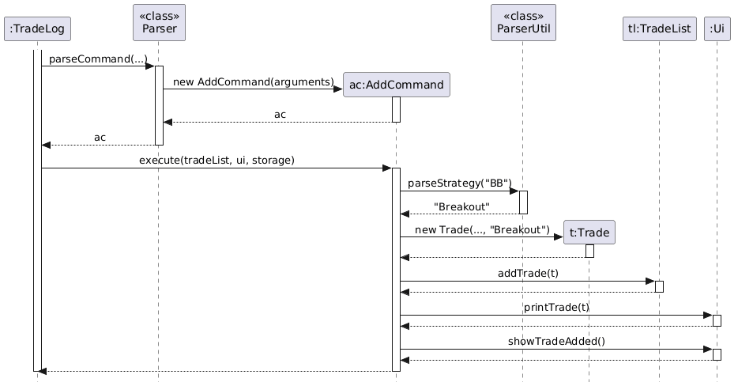

##### Design Rationale

Expansion is done at parse time, not at display time. This means:

1. The expanded name is what gets stored in the file. If the user runs `list`, they see `Breakout`, not `BB`.
2. The `compare` command (see below) groups by the expanded name, so `BB` and `Breakout` entered by different team members are correctly unified.
3. The `Trade` object is always constructed with a clean, canonical strategy name.

**Alternatives considered:**

- **Expand at display time only**: Rejected because stored data would contain abbreviations, making the storage file harder to read and causing grouping bugs in the `compare` command.
- **Store the abbreviation and expand only in reports**: Rejected for the same reasons as above. Canonical data at the source is simpler and safer.
- **Use an enum instead of a lookup map**: Considered, but a lookup map keeps the parsing logic lightweight and easy to extend.

---

### 2.14 Strategy Comparison Feature (`compare` command)

##### Overview

The `compare` command allows a trader to see performance metrics broken down by strategy. Instead of viewing one aggregate summary across all trades, the user can see exactly how each individual strategy performs - win rate, average win, average loss, and expected value (EV) - in a single command.

**Example output:**

```
compare

Strategy Comparison:

Breakout:
Trades: 15
Win Rate: 60%
Average Win: 2.02R
Average Loss: 0.95R
EV: +0.832R

Pullback:
Trades: 20
Win Rate: 50%
Average Win: 1.50R
Average Loss: 1.00R
EV: +0.250R
```

##### Architecture-Level Description

The `compare` command follows the same architecture as every other command in TradeLog. It fits into the existing structure without requiring any changes to `TradeLog`, `TradeList`, or `Storage`.

The new classes and modifications required are:

| Class            | Change                                                   |
|------------------|----------------------------------------------------------|
| `CompareCommand` | New class extending `Command`                            |
| `StrategyStats`  | New helper class for per-strategy aggregates             |
| `Parser`         | Add `case "compare"` to the switch                       |
| `Ui`             | Add `showStrategyComparison(Map<String, StrategyStats>)` |

A helper value object `StrategyStats` is introduced to group per-strategy metrics:

```java
class StrategyStats {
    int tradeCount;
    int winCount;
    int lossCount;
    double totalWinR;
    double totalLossR;
}
```

##### Component-Level Description

The `execute` method of `CompareCommand` performs the following steps:

1. **Guard**: If `tradeList` is empty, delegate to `ui.showSummaryEmpty()` and return.
2. **Grouping**: Iterate through all trades. For each trade, call `trade.getStrategy()` and use `strategyComparison.computeIfAbsent(...)` on a `LinkedHashMap<String, StrategyStats>` to look up or create the corresponding accumulator. A `LinkedHashMap` is used to preserve insertion order so strategies appear in the order they were first logged.
3. **Accumulation**: Call `trade.getRiskRewardRatio()` and pass the result to `strategyStats.addTrade(...)` so the per-strategy counts and totals are updated in one place.
4. **Display**: After the loop, pass the populated map to `ui.showStrategyComparison(...)`, which formats and prints each strategy block.

##### Sequence Diagram - `compare` execution

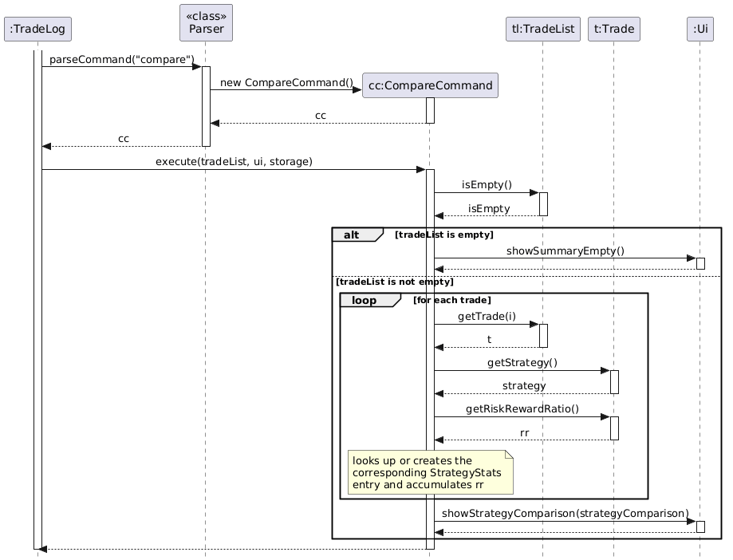

##### Class Diagram - CompareCommand and its dependencies

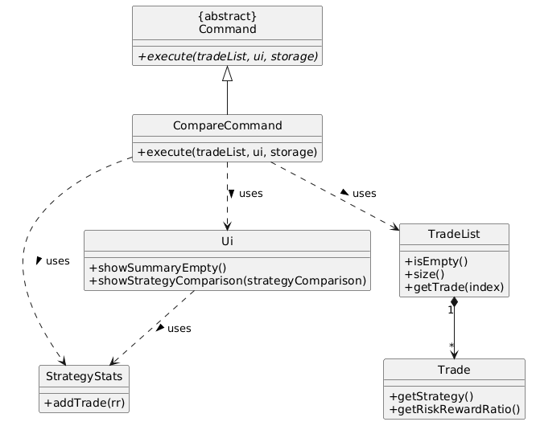

##### Object Diagram - Example runtime snapshot during `compare`

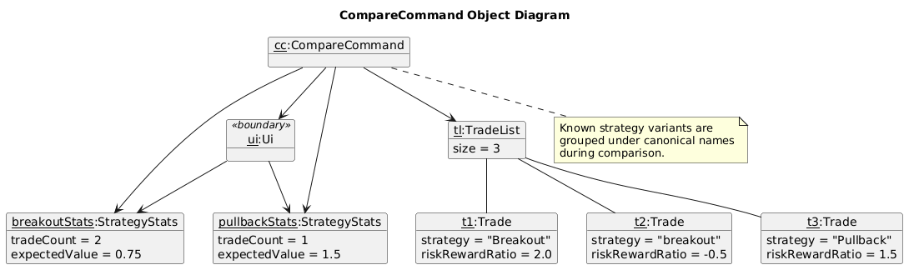

##### Design Rationale

**Why a `LinkedHashMap` and not sorting alphabetically?**
Traders tend to think of their strategies in the order they used them, not alphabetically. Preserving insertion order makes the output feel natural.

**Why not add grouping logic to `TradeList`?**
`TradeList` is a model class that should only manage the collection - add, delete, get, and size. Adding grouping logic there would violate single responsibility. `CompareCommand` is the correct place for this aggregation, consistent with how `SummaryCommand` handles its own calculations.

**Why not reuse `SummaryCommand`'s logic?**
`SummaryCommand` calculates one aggregate result. `CompareCommand` calculates `n` independent results (one per strategy). Though the per-strategy arithmetic is similar, merging them into a single class would make both harder to read, test, and extend independently.

**Alternatives considered:**

- **A `filterByStrategy` method on `TradeList`**: This was considered to avoid iterating through all trades in `CompareCommand`. However, it would require multiple passes (one per unique strategy), making it O(n x k) where `k` is the number of strategies. The single-pass accumulation approach is O(n) and simpler.
- **Storing `StrategyStats` inside `TradeList` as a cached field**: Rejected because it would couple the model to a specific reporting concept and require cache invalidation on every add/edit/delete.

---

### 2.15 Storage Component (Encrypted Persistence)

##### Architecture-Level Description

`Storage` is the sole class responsible for reading and writing trade data to disk. New profiles save in plaintext by default, but the `encrypt` command can switch future saves to or from **AES-128** encrypted mode. The encryption key is derived from the user's password via a **SHA-256** hash, with only the first 16 bytes used to form the AES key.

The file format is:

```
<SHA-256 password hash (Base64)>
<ENCRYPTED:true|false>
<trade line 1, encrypted Base64 or plaintext depending on flag>
<trade line 2, encrypted Base64 or plaintext depending on flag>
...
```

The first line is the Base64-encoded SHA-256 hash of the password. This is used on load to verify that the correct password has been provided before any decryption is attempted.

`Storage` has no dependency on `Ui`, `Parser`, or any `Command`. It only depends on `TradeList` and `Trade` from the model layer, keeping coupling minimal.

##### Component-Level Description

| Method                  | Responsibility                                                                                                                                                                                                       |
|-------------------------|----------------------------------------------------------------------------------------------------------------------------------------------------------------------------------------------------------------------|
| `setPassword(String)`   | Derives the AES key and stores the password hash. Must be called before `saveTrades` or `loadTrades`.                                                                                                                |
| `saveTrades(TradeList)` | Creates parent directories if needed, writes the password hash on line 1, writes the encryption-status flag on line 2, then writes one trade string per line in encrypted or plaintext form.                         |
| `loadTrades()`          | Reads line 1 and compares it to `passwordHash`. If it matches, reads the encryption-status flag, then decrypts or reads each subsequent line, parses the 7-field pipe-delimited format, and populates a `TradeList`. |
| `exists()`              | Returns whether the underlying file is present on disk. Used by `ProfileManager` during startup.                                                                                                                     |

The encryption and decryption use Java's `javax.crypto.Cipher` in `AES/ECB` mode (the default single-block `"AES"` transformation). When encryption is enabled, each trade's `toStorageString()` output (pipe-delimited) is individually encrypted and Base64-encoded before being written as a line.

##### Sequence Diagram — `saveTrades` on exit


##### Sequence Diagram — `loadTrades` on startup


##### Design Rationale

**Why derive the key from a password hash rather than storing the key directly?**
The password hash acts as both the AES key seed and the per-file identity marker (the first line of each profile file). This allows `ProfileManager` to determine which file belongs to which user without storing any plaintext credential.

**Why AES-128 and not AES-256?**
AES-128 (16-byte key) is sufficient for protecting trade records from casual access in the current implementation.

**Why encrypt each trade line independently rather than the whole file?**
Individual-line encryption makes the format robust: a single corrupted line affects only that trade, not the rest of the file. It also maps naturally to the line-by-line read loop in `loadTrades` when encryption is enabled.

**Alternatives considered:**
- **Storing plaintext**: Rejected. A trader's position sizes, entry/exit prices, and strategies are commercially sensitive. Plaintext storage would expose this data to anyone with filesystem access.
- **Storing only a password prompt and trusting the key**: Rejected because without the stored hash on line 1, `ProfileManager` would have no way to distinguish a wrong-password decryption failure from a corrupted file.

---

### 2.16 ProfileManager (Multi-Profile Support)

##### Architecture-Level Description

`ProfileManager` is the startup component that resolves which storage file belongs to the current user. It sits between `TradeLog`'s constructor and the `Storage` class, and is the only class that knows how multiple profile files are named or how to scan them.

The password is **not** passed in from `TradeLog`. Instead, `ProfileManager` reads it interactively from the user via `Ui.readPassword()` at startup, displaying a context-sensitive prompt depending on whether any profile files already exist.

Profile files follow the naming convention:

```
<baseDir>/<baseName>.txt          ← index 0 (the default)
<baseDir>/<baseName>_1.txt        ← index 1
<baseDir>/<baseName>_2.txt        ← index 2
...
```

Each file belongs to exactly one password (identified by the SHA-256 hash stored on its first line). `findNextAvailablePath()` determines the path for a new profile by scanning for the first suffix index whose file does not yet exist.

##### Component-Level Description

The constructor `ProfileManager(String baseDir, String baseName, Ui ui)` runs the following logic:

1. **Determine whether any profile files exist** by checking if `<baseDir>/<baseName>.txt` is present on disk.
2. **Prompt for a password** via `ui.readPassword(prompt)`:
   - If no files exist: `"No profiles found. Create a new password:"`
   - If files exist: `"Enter password to load your profile (or create a new one):"`
   - If the input is blank: show an error and prompt again.
   - If the input stream closes: abort startup rather than looping indefinitely.
3. **Branch on file existence:**
   - **No files exist** → call `createNewProfile(...)` immediately with message `"No existing profile found. Creating new profile..."` and exit.
   - **Files exist** → call `tryLoadExistingProfile(...)`:
     - **Returns `true`** (password matched a file): constructor exits successfully.
     - **Returns `false`** (no file matched the password): prompt the user `"No profile found for the entered password. Create a new profile? (yes/no):"`.
       - If the user answers `"yes"`: call `createNewProfile(...)` with message `"Creating new profile..."` and exit.
       - If the user answers anything else: loop back to step 2 and re-prompt for the password.

After the constructor completes, `getActiveStorage()` and `getLoadedTrades()` pass the result to `TradeLog`.

| Method                                                 | Responsibility                                                                                                                              |
|--------------------------------------------------------|---------------------------------------------------------------------------------------------------------------------------------------------|
| `ProfileManager(String, String, Ui)`                   | Interactive startup: prompts for password, finds or creates the matching profile.                                                           |
| `tryLoadExistingProfile(String, String, String, Ui)`   | Iterates over existing numbered files, attempts `setPassword` + `loadTrades` on each; returns `true` on a hash match.                       |
| `createNewProfile(String, String, String, Ui, String)` | Finds the next available file path, initialises a fresh `Storage`, calls `setPassword`, and sets `loadedTrades` to a new empty `TradeList`. |
| `findNextAvailablePath(String, String)`                | Returns the first `<baseDir>/<baseName>_N.txt` path (or `<baseName>.txt` for index 0) that does not yet exist on disk.                      |
| `getActiveStorage()`                                   | Returns the `Storage` instance resolved during construction.                                                                                |
| `getLoadedTrades()`                                    | Returns the `TradeList` loaded (or newly created) during construction.                                                                      |

At the application level, `TradeLog.run()` saves in a `finally` block and also registers a shutdown hook. This ensures normal exits, end-of-input termination, and JVM shutdown events still attempt to persist the current trade list once.

##### Sequence Diagram — startup with an existing matching profile


##### Sequence Diagram — startup when password does not match, user opts to create new profile


##### Design Rationale

**Why does `ProfileManager` read the password interactively rather than receiving it as a constructor argument?**
Keeping password acquisition inside `ProfileManager` avoids passing a sensitive credential through `TradeLog`'s constructor. `ProfileManager` owns the full login loop — prompting, validating, and retrying — without exposing that state to its caller.
**Why scan files sequentially rather than encoding the profile index in the file itself?**
Keeping profile selection implicit (driven purely by password matching) means the user never needs to remember a profile number. The password is the sole credential.

**Why prompt the user before creating a new profile when no match is found?**
Silently creating a new profile on a password mismatch would produce spurious empty profiles from typographical errors. The `yes/no` confirmation lets the user retry their password instead, preventing unintended profile proliferation.

**Alternatives considered:**
- **Single file for all users**: Rejected. A single file would require a more complex internal structure to separate users' data and would make per-user password protection harder.
- **Using a directory per user**: Considered but rejected for simplicity. The sequential suffix convention is easy to implement and requires no directory management.

### 2.17 ModeManager (Environment Mode Control)

##### Architecture-Level Description

`ModeManager` is a singleton component that maintains the application's global operational state: `BACKTEST` or `LIVE`. It acts as a central "truth source" for other modules (such as `Logic` and `Model`) to determine if specific environment constraints—like daily loss limits or trade date validation—should be active.

As a structural anchor, it ensures that the environment state is unified across the system. The use of a Singleton pattern prevents "split-brain" scenarios where different components might otherwise operate under conflicting environmental rules.

##### Component-Level Description

`ModeManager` provides a thread-safe global access point to the `EnvironmentMode`. It encapsulates the logic for generating warning messages and state transitions.

| Method                     | Responsibility                                                            |
|----------------------------|---------------------------------------------------------------------------|
| `getInstance()`            | Returns the thread-safe singleton instance of `ModeManager`.              |
| `getCurrentMode()`         | Returns the current active `EnvironmentMode` (BACKTEST or LIVE).          |
| `setMode(EnvironmentMode)` | Updates the application's global state to the specified mode.             |
| `getWarningMessage()`      | Generates detailed risk warnings based on the target mode's restrictions. |

##### Class Diagram — ModeManager Structure

The following diagram illustrates the Singleton structure of `ModeManager` and its relationship with the `EnvironmentMode` enumeration.

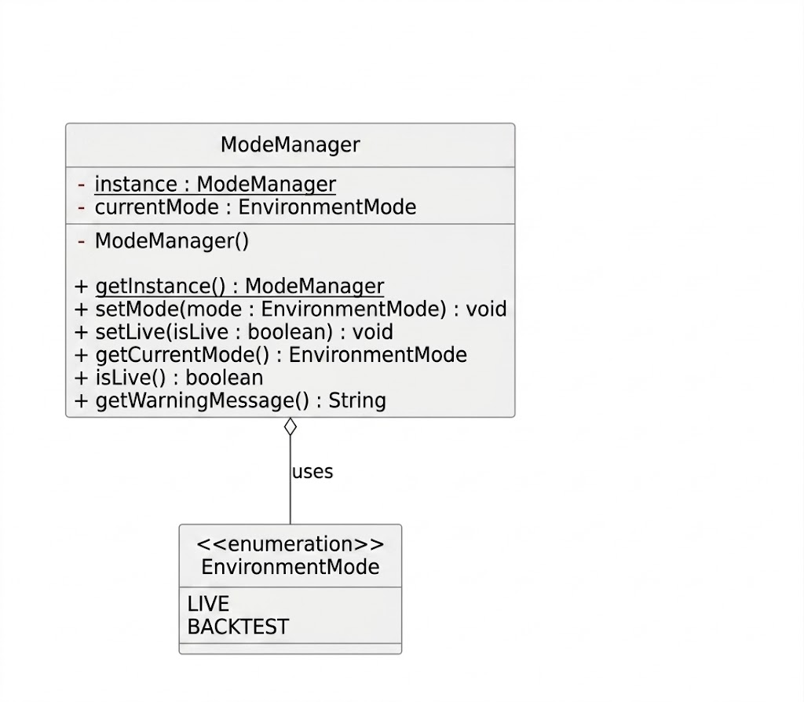

##### Design Rationale

**Why use a Singleton for `ModeManager`?**
Environment state must be unique. If multiple instances existed, different parts of the system (e.g., Validation and Storage) could disagree on whether the system is "Live," leading to critical data integrity issues.

---

### 2.18 SetModeCommand (Interactive Mode Transition)

##### Architecture-Level Description

`SetModeCommand` handles the `mode` command using a **two-phase interactive flow**. Unlike standard commands, it halts execution to wait for user confirmation. It serves as the primary bridge between the user's intent, the `Ui`'s visual partitioning, and `ModeManager`'s state.

This command utilizes specialized `Ui` methods to ensure that risk warnings are boxed within dividers, maintaining a clear distinction between a "proposed" change and a "confirmed" one.

##### Component-Level Description

The `execute(TradeList, Ui, Storage)` method implements a conditional branching logic based on the user's response to a risk warning:

1.  **Preparation**: Fetches the current mode and validates the target.
2.  **Phase 1 (Prompt)**: Triggers `ui.showModePromptBlock()`, which internally calls `ModeManager` for the warning details.
3.  **User Interception**: The command calls `ui.readCommand()` and waits for the user's input string.
4.  **State Resolution (Alt Branch)**:
    - If the response equals `"yes"`, `ModeManager.setMode()` is called and a success message is displayed.
    - Otherwise, the state change is skipped, and an abort message is displayed.
5.  **Control Flow**: Every method call (including `void` methods) returns control to the command to proceed to the next step or termination.

| Method                             | Responsibility                                                                                          |
|------------------------------------|---------------------------------------------------------------------------------------------------------|
| `execute(tradeList, ui, storage)`  | Orchestrates the two-phase switch: validates, prompts, reads input, and updates the mode conditionally. |
| `SetModeCommand(String)`           | Constructor that parses the raw input string into the target `EnvironmentMode`.                         |

##### Sequence Diagram — Mode Transition Logic

The following diagram captures the complete synchronous flow of a mode switch, highlighting the conditional branch (`alt`) based on the user's confirmation.

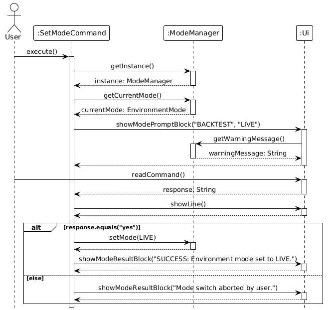

##### Design Rationale

**Why is the mode switch interactive?**
`LIVE` mode introduces strict financial discipline (e.g., irreversible loss limit checks). An interactive `"yes"` confirmation ensures the user has visually engaged with the rules before the system lock-in occurs.

**Why use high-level UI methods like `showModePromptBlock`?**
This maintains the **Logic-UI separation**. `SetModeCommand` does not know how to draw dividers or format text; it simply requests a "Prompt Block" or "Result Block," leaving the visual implementation to the `Ui` class.

**Why include control returns for `void` methods?**
Strict adherence to the synchronous execution model ensures that no message is lost and the application state is updated only after the user acknowledgment is fully processed.

---

## Appendix A: Non-Functional Requirements

1. **Platform Independence**: Must run on any OS with Java 17 or higher installed.
2. **Performance**: Summary and comparison calculations should complete within 100 ms for up to 2,000 trades on a typical modern desktop.
3. **Data Persistence**: Trade data should be stored locally in profile files and saved successfully when the application exits normally.
4. **Offline Capability**: All trade data must be stored locally without requiring cloud connectivity.

---

## Appendix B: User Stories

| Version  | As a ...                 | I want to ...                                                                | So that I can ...                         |
|:---------|:-------------------------|:-----------------------------------------------------------------------------|:------------------------------------------|
| **v1.0** | trader                   | log my trading data                                                          | review and analyze my trades later        |
| **v1.0** | trader                   | edit previously logged trades                                                | correct mistakes in my data               |
| **v1.0** | trader                   | delete an incorrectly entered trade                                          | keep my records accurate                  |
| **v1.0** | trader                   | view a summary of my trades                                                  | understand overall performance quickly    |
| **v2.0** | trader                   | filter my trades by ticker, strategy, or date                                | review a specific subset of my trades     |
| **v2.0** | power user               | use shortcut codes for strategy names (e.g., `BB`, `PB`)                     | log trades faster                         |
| **v2.0** | trader                   | compare performance across strategies in one view                            | identify which strategy performs better   |
| **v2.0** | cautious trader          | undo my most recent add, edit, or delete                                     | recover quickly from an accidental change |
| **v2.0** | privacy-conscious trader | protect my trade records with password-based storage and optional encryption | keep sensitive trading data private       |

---

## Appendix C: Glossary

* **Ticker**: Unique symbol representing a traded asset (e.g., AAPL).
* **R:R (Risk:Reward)**: The ratio of potential profit to potential loss.
* **EV (Expected Value)**: The average amount a trader can expect to win or lose per trade.
* **R-multiple**: A trade's profit or loss expressed as a multiple of the initial risk (e.g., a 2R win means the trade made twice the amount risked).
* **Strategy shortcut**: A predefined abbreviation (e.g., `BB`) that the system validates and expands to a full canonical strategy name (e.g., `Breakout`) at parse time.

---

## Appendix D: Instructions for Manual Testing

### D.1 Initial Launch

1. Ensure the `data/` folder does not contain any existing profile files.
2. Run `java -jar TradeLog.jar`.
3. When prompted with `No profiles found. Create a new password:`, enter a new password.
4. Verify that the application starts successfully and displays the welcome banner, command list, and supported strategy shortcuts.
5. Exit the application and verify that a new profile file is created in `data/`.
6. Repeat the launch with a blank password and verify that TradeLog rejects it with an error instead of creating a profile.

### D.2 Testing CRUD

1. Run: `add t/TSLA d/2026-03-18 dir/long e/200 x/220 s/190 strat/Breakout`
2. Verify that the trade summary is printed and `Trade successfully added.` is shown.
3. Run: `list`
4. Verify that the trade appears as item `1`.
5. Run: `edit 1 x/230`
6. Verify that the application shows `Trade 1 updated successfully.` and prints the updated trade summary.
7. Run: `summary`
8. Verify that the overall performance block is shown for the current trade list.
9. Run: `delete 1`
10. Verify that the deleted trade is printed followed by `Trade successfully deleted.`
11. Run: `list`
12. Verify that the list is now empty.

### D.3 Testing Current Features

1. Run: `add t/AAPL d/2026-03-18 dir/long e/150 x/165 s/140 strat/BB`
2. Verify that the trade summary is printed and the strategy is shown as `Breakout`, not `BB`.
3. Run: `add t/TSLA d/2026-03-19 dir/short e/200 x/190 s/210 strat/PB`
4. Verify that the second trade is added successfully and the strategy is shown as `Pullback`.
5. Run: `filter s/Breakout`
6. Verify that only the `Breakout` trade is shown.
7. Run: `filter t/AP`
8. Verify that the same `Breakout` trade is matched by ticker substring.
9. Run: `compare`
10. Verify that `Breakout` and `Pullback` appear as separate strategy blocks with their own trade counts and metrics.
11. Run: `add t/MSFT d/2026-03-20 dir/long e/100 x/120 s/90 strat/breakout`
12. Verify that the added trade is stored and displayed as `Breakout`.
13. Run: `compare`
14. Verify that the lowercase input is grouped under the same `Breakout` block rather than appearing as a separate strategy.
15. Run: `undo`
16. Verify that the most recent change is undone.
17. Run: `list`
18. Verify that the third trade is no longer present.
19. Run: `undo` again.
20. Verify that the application reports there is no action to undo.
21. Run TradeLog, add a trade, then end the input stream without typing `exit`.
22. Verify that the trade is still present on the next launch.


