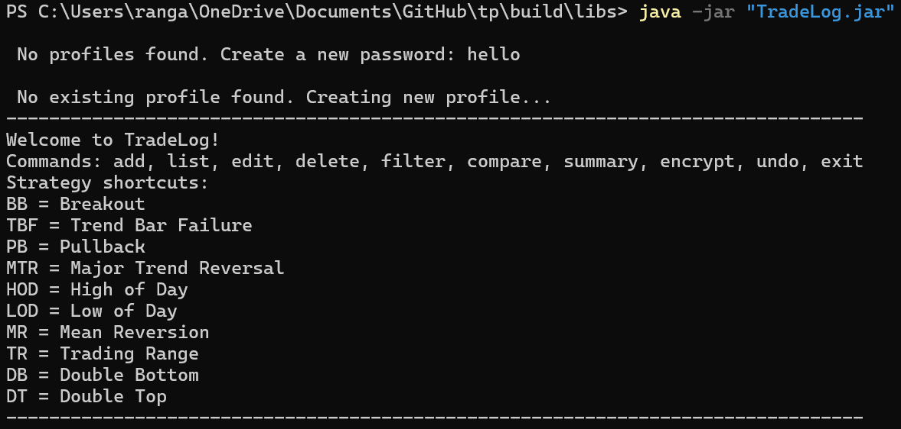

# User Guide

## TradeLog

TradeLog is a desktop app for traders who prefer working with a Command Line Interface (CLI). It helps you log trades, review performance in `R` multiples, and compare results across strategies.

TradeLog is optimized for users who can type quickly and prefer entering commands over clicking through forms.

## Table of Contents

- [Quick start](#quick-start)
- [Features](#features)
  - [Notes about the command format](#notes-about-the-command-format)
  - [Starting TradeLog and loading your profile](#starting-tradelog-and-loading-your-profile)
  - [Adding a trade: `add`](#adding-a-trade-add)
  - [Listing all trades: `list`](#listing-all-trades-list)
  - [Editing a trade: `edit`](#editing-a-trade-edit)
  - [Deleting a trade: `delete`](#deleting-a-trade-delete)
  - [Filtering trades: `filter`](#filtering-trades-filter)
  - [Comparing strategies: `compare`](#comparing-strategies-compare)
  - [Viewing overall performance: `summary`](#viewing-overall-performance-summary)
  - [Toggling storage encryption: `encrypt`](#toggling-storage-encryption-encrypt)
  - [Undoing the most recent change: `undo`](#undoing-the-most-recent-change-undo)
  - [Switching environment modes: `mode`](#switching-environment-modes-mode)
  - [Exiting the program: `exit`](#exiting-the-program-exit)
- [FAQ](#faq)
- [Command summary](#command-summary)

## Quick start

1. Ensure that you have **Java 17** or above installed.
2. Download the latest `TradeLog.jar` from [the releases page](https://github.com/AY2526S2-CS2113-T11-2/tp/releases).
3. Open a terminal in the folder containing `TradeLog.jar`.
4. Run `java -jar TradeLog.jar`.
5. If this is your first time using TradeLog, enter a password to create a profile.
6. If you already have a profile, enter its password to load it.
7. Type commands in the terminal and press Enter to execute them.



## Features

### Notes about the command format

- Words in `UPPER_CASE` are parameters to be supplied by the user.
  Example: in `add t/TICKER`, `TICKER` can be `AAPL`.
- Items in square brackets are optional.
  Example: `edit 2 x/205`
- Parameters with prefixes can be written in any order.
  Example: `add t/AAPL d/2026-03-18 ...` and `add d/2026-03-18 t/AAPL ...` are both accepted.
- Trade indices shown by the app are 1-based.
- Strategy shortcuts such as `BB` and `PB` are expanded automatically.
- For strategy filtering, use `s/STRATEGY`.
- Supported strategy names are matched case-insensitively and stored in canonical form.

Current strategy shortcuts:

| Shortcut | Expanded strategy    |
|:---------|:---------------------|
| `BB`     | Breakout             |
| `TBF`    | Trend Bar Failure    |
| `PB`     | Pullback             |
| `MTR`    | Major Trend Reversal |
| `HOD`    | High of Day          |
| `LOD`    | Low of Day           |
| `MR`     | Mean Reversion       |
| `TR`     | Trading Range        |
| `DB`     | Double Bottom        |
| `DT`     | Double Top           |

### Starting TradeLog and loading your profile

When TradeLog starts, it asks for a password before showing the command prompt.

- If no profile exists yet, the password creates a new profile.
- If profiles already exist, TradeLog tries to load the profile matching that password.
- If no existing profile matches, TradeLog asks whether you want to create a new profile.
- Passwords cannot be blank.
- Trades are saved automatically when you exit the program.
- If the input stream ends unexpectedly, TradeLog still attempts to save the current session before shutting down.

Trade data is stored in password-protected profile files inside the `data/` folder.
Encryption is disabled by default and can be toggled with `encrypt`.

### Adding a trade: `add`

Adds a trade to the current profile and shows its trade summary.

Format:

```text
add t/TICKER d/DATE dir/DIRECTION e/ENTRY x/EXIT s/STOP strat/STRATEGY
```

Example:

```text
add t/AAPL d/2026-03-18 dir/long e/150 x/165 s/140 strat/BB
```

Expected output:

```text
--------------------------------------------------------------------------------
Trade Summary:
Ticker: AAPL
Date: 2026-03-18
Direction: Long
Entry: 150
Exit: 165
Stop: 140
Strategy: Breakout

Risk:Reward: +1.50R
--------------------------------------------------------------------------------
Trade successfully added.
```

Notes:

- All fields are required in the current version.
- `dir/` must be `long` or `short`.
- The stop loss must be on the correct side of the entry price for the chosen direction.
- `strat/` must be one of the supported strategy shortcuts or supported full strategy names.

### Listing all trades: `list`

Shows all trades in the current profile.

Format:

```text
list
```

Example output:

```text
--------------------------------------------------------------------------------
1. AAPL | 2026-03-18 | Long | E:150 | TP:165 | SL:140 | Win | Breakout
2. TSLA | 2026-03-19 | Short | E:200 | TP:190 | SL:210 | Loss | Pullback
--------------------------------------------------------------------------------
```

If there are no trades, TradeLog shows:

```text
--------------------------------------------------------------------------------
No trades logged yet.
--------------------------------------------------------------------------------
```

### Editing a trade: `edit`

Edits one trade by index. Only the specified fields are changed.

Format:

```text
edit INDEX [t/TICKER] [d/DATE] [dir/DIRECTION] [e/ENTRY] [x/EXIT] [s/STOP] [strat/STRATEGY]
```

Example:

```text
edit 2 x/205 s/205
```

Expected output shape:

```text
Trade 2 updated successfully.
--------------------------------------------------------------------------------
Trade Summary:
...
--------------------------------------------------------------------------------
```

Notes:

- `INDEX` must refer to an existing trade shown by `list` or `filter`.
- Strategy shortcuts also work in `edit`.
- Unsupported strategy names are rejected in `edit` just as they are in `add`.

### Deleting a trade: `delete`

Deletes a trade by index.

Format:

```text
delete INDEX
```

Example:

```text
delete 2
```

TradeLog first shows the deleted trade summary, then confirms the deletion.

### Filtering trades: `filter`

Filters trades by ticker or strategy.

Format:

```text
filter t/TICKER
filter s/STRATEGY
```

Examples:

```text
filter t/AAPL
filter s/Breakout
filter s/BB
```

Current behavior:

- `t/` filters trades by ticker using case-insensitive substring matching.
- `s/` filters trades by strategy using exact case-insensitive matching after shortcut expansion.
- Matching trades are shown using their original indices from the full trade list.
- If no trades match, TradeLog shows `No trades found matching: ...`.

Example output:

```text
--------------------------------------------------------------------------------
2. AAPL | 2026-03-18 | Long | E:150 | TP:165 | SL:140 | Win | Breakout
--------------------------------------------------------------------------------
```

Notes:

- Strategy filters use the `s/` prefix.
- Strategy shortcuts such as `BB` are accepted and treated the same as their canonical names such as `Breakout`.

### Comparing strategies: `compare`

Shows grouped performance metrics for each strategy found in the current profile.

Format:

```text
compare
```

Example output:

```text
--------------------------------------------------------------------------------
Strategy Comparison:

Breakout:
  Trades: 2
  Win Rate: 50%
  Average Win: 2.00R
  Average Loss: 1.00R
  EV: +0.500R

Pullback:
  Trades: 1
  Win Rate: 100%
  Average Win: 1.50R
  Average Loss: 0.00R
  EV: +1.500R

--------------------------------------------------------------------------------
```

If there are no trades, TradeLog shows the same empty-summary message used by `summary`.

Known strategy variants are grouped under the same canonical strategy name during comparison.

### Viewing overall performance: `summary`

Shows overall performance across all trades in the current profile.

Format:

```text
summary
```

Example output:

```text
--------------------------------------------------------------------------------
Overall Performance:

Total Trades: 3
Win Rate: 33%
Average Win: 2.00R
Average Loss: 0.50R
Overall EV: +0.50R
Total R: +1.50R
--------------------------------------------------------------------------------
```

Note:

- Summary statistics are calculated from each trade's risk-reward ratio.

### Toggling storage encryption: `encrypt`

Enables, disables, or checks whether encryption is active for saved trades.

Format:

```text
encrypt on
encrypt off
encrypt status
```

Current behavior:

- New profiles start with encryption disabled.
- `encrypt on` enables AES encryption for future saves.
- `encrypt off` saves future trades in plaintext.
- `encrypt status` shows the current save mode.

### Undoing the most recent change: `undo`

Reverts the most recent add, edit, or delete.

Format:

```text
undo
```

Current behavior:

- Only one level of undo is supported.
- If there is no previous change to undo, TradeLog tells you so.

### Switching environment modes: `mode`

Switches the application between `BACKTEST` and `LIVE` modes. This changes validation strictness and risk enforcement rules.

Format:
```text
mode MODE
```
(MODE must be live or backtest.)

Current behavior
```text
mode live
```

Expected Output:
```text
Switching to: LIVE

WARNING: Live mode enforces strict discipline:
- Only trades with today's date (2026-04-14) can be added.
- Daily Loss Limit checks will be active.
- Edits to historical data will be restricted.

Enter 'yes' to confirm the switch, or any other key to cancel:

```

### Exiting the program: `exit`

Saves trades and closes TradeLog.

Format:

```text
exit
```

On exit, TradeLog shows the goodbye banner and then saves the current profile automatically.

## FAQ

**Q: Where is my data stored?**

**A:** In password-protected profile files inside the `data/` folder. New profiles save in plaintext unless you enable encryption.

**Q: Can I have more than one profile?**

**A:** Yes. Using a different password can create a different profile.

**Q: What if my terminal session ends without typing `exit`?**

**A:** TradeLog still attempts to save the current session before shutting down.

**Q: Can I undo multiple steps?**

**A:** No. The current version supports only one-step undo.

## Command summary

| Action               | Format                                                                                        |
|----------------------|-----------------------------------------------------------------------------------------------|
| Add trade            | `add t/TICKER d/DATE dir/DIRECTION e/ENTRY x/EXIT s/STOP strat/STRATEGY`                      |
| List trades          | `list`                                                                                        |
| Edit trade           | `edit INDEX [t/TICKER] [d/DATE] [dir/DIRECTION] [e/ENTRY] [x/EXIT] [s/STOP] [strat/STRATEGY]` |
| Delete trade         | `delete INDEX`                                                                                |
| Filter trades        | `filter t/TICKER`, `filter s/STRATEGY`                                                        |
| Compare strategies   | `compare`                                                                                     |
| View overall summary | `summary`                                                                                     |
| Toggle encryption    | `encrypt on`, `encrypt off`, `encrypt status`                                                 |
| Undo last change     | `undo`                                                                                        |
| Switch mode          | `mode live`, `mode backtest`                                                                  |
| Exit                 | `exit`                                                                                        |

